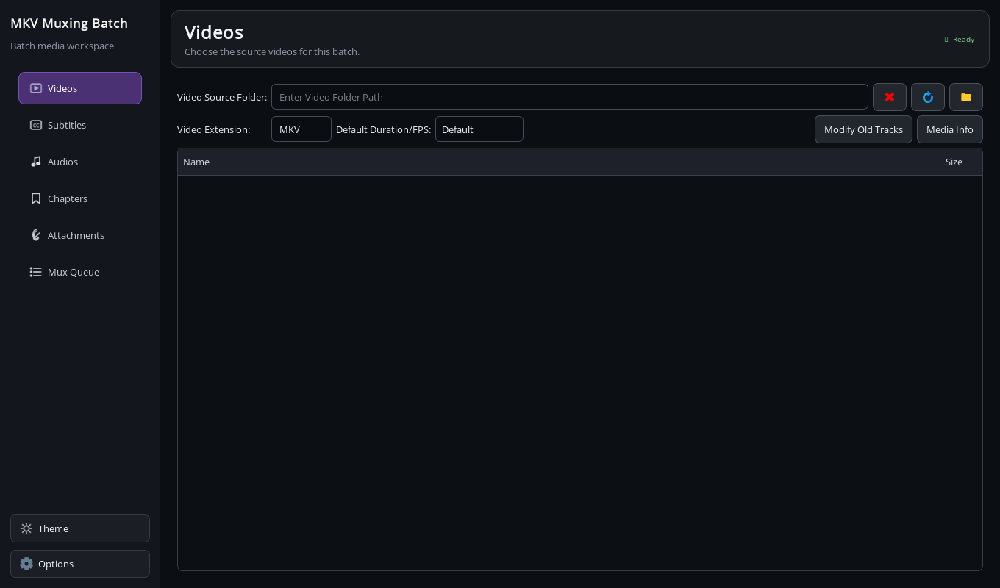

<div align="center">


# MKV Muxing Batch

**Build the batch. Trust the queue. Walk away.**

A focused desktop workspace for muxing entire video collections with precise track control.

[](https://github.com/dev-zetta/mkv-muxing-batch-gui/releases/latest)
[](https://github.com/dev-zetta/mkv-muxing-batch-gui/releases)
[](https://github.com/dev-zetta/mkv-muxing-batch-gui/actions/workflows/build-and-release.yml)
[](https://github.com/dev-zetta/mkv-muxing-batch-gui/releases/latest)
[](https://www.python.org/)
[](LICENSE)

[Download](#download) · [Changelog](CHANGELOG.md) · [See what it can do](#what-it-does) · [Run from source](#run-from-source) · [Report a problem](https://github.com/dev-zetta/mkv-muxing-batch-gui/issues)

</div>



> Fifty episodes should feel like one job—not fifty opportunities for something to go wrong.

MKV Muxing Batch turns a folder full of videos, subtitles, audio tracks, chapters, and attachments into one controlled workflow. Match the files, decide exactly how every track should behave, add the batch to the queue, and let the application carry it to completion.

This maintained fork is built around three promises: **large queues should stay stable, interrupted work should be recoverable, and repetitive metadata work should happen once—not file by file.**

## Why this fork exists

The original project solved a real problem and grew an unusually capable muxing tool. This fork carries that work forward with an active focus on reliability, recovery, and a calmer modern desktop experience.

Recent work includes:

- safer worker and process cleanup for long muxing sessions;
- persistent queues with crash and restart recovery;
- batch templates for video titles and audio/subtitle track names;
- a redesigned dark interface with clear navigation and a queue-first workspace;
- a tested Windows release pipeline with installer, portable archive, and SHA-256 checksums.

## What it does

### Survives the long jobs

The queue is saved automatically. If the application or machine stops unexpectedly, unfinished work is restored on the next launch. Completed jobs remain completed, while the interrupted job is safely returned to the queue instead of being mistaken for a success.

### Handles tracks as tracks—not just files

- Add multiple subtitle and audio sets to every video.
- Configure language, delay, track name, default/forced state, and output position independently.
- Reorder mismatched filenames manually; subtitle and audio filenames do not need to mirror video filenames.
- Inspect existing tracks, discard unwanted tracks, or keep only selected languages and track IDs.
- Modify existing track names, languages, order, default state, and forced state.

### Renames a whole collection in one pass

The **Metadata Names** dialog applies templates across the batch without touching fields you leave blank.

Available placeholders:

```text
{old}       existing title or track name
{filename}  source filename including its extension
{stem}      source filename without its extension
{index}     one-based position in the batch
{language}  configured track language
```

For example, `{stem}` can make every MKV title follow its source filename, while `{language} - {old}` can normalize track names without erasing their original labels.

### Covers the rest of the container

- Add XML chapters per video.
- Attach fonts, artwork, or other files to every output.
- Use expert attachment mode to assign different files or folders to individual videos.
- Skip attachments already present in a source file.
- Preserve logs, add or remove CRC metadata, and control output destinations.
- Save favorite directories, languages, extensions, and other defaults as presets.

## The workflow

1. **Choose videos** — load the source collection and inspect its media information.
2. **Build the container** — match subtitles, audio, chapters, and attachments; configure each track.
3. **Shape the output** — choose a destination, decide which original tracks survive, and apply metadata templates.
4. **Trust the queue** — review the jobs, start muxing, and let automatic persistence protect unfinished work.

## Download

The project supports **64-bit Windows 10 and Windows 11**, plus modern x86-64
Linux distributions.

[**Download the latest release →**](https://github.com/dev-zetta/mkv-muxing-batch-gui/releases/latest)

Choose the installer for a normal Windows installation or the portable ZIP
when you want a self-contained Windows copy. The Linux archive requires the
system MKVToolNix package. Published binary assets include a matching
`SHA256SUMS.txt` file for integrity verification.

## Supported files

- **Video:** AVI, MKV, MP4, M4V, MOV, MPEG, TS, OGG, OGM, H264, H265, WEBM, WMV
- **Subtitle:** ASS, SRT, SSA, SUP, PGS, MKS, VTT
- **Audio:** AAC, AC3, FLAC, EAC3, MKA, M4A, MP3, DTS, DTSMA, THD, WAV, OGG, OPUS
- **Chapter:** XML

The application uses [MKVToolNix](https://mkvtoolnix.download/) for Matroska processing.

If MKVToolNix is missing, the application still opens and offers to take you
to the official download page. You can install it, choose **Check Again**, or
continue browsing the application without muxing.

On startup, a background check compares the installed MKVToolNix version with
the official release feed and the application version with this repository's
latest stable GitHub release. Only available updates are announced; offline
startup remains silent and fully usable. A manual **Check for Updates** action
is available in **Options → About**. These runtime checks contact
`mkvtoolnix.download` and `api.github.com` but never download or install
anything automatically.

## Before muxing

> [!WARNING]
> Leaving the destination folder empty means the application will replace the source videos after asking for confirmation. Keep a backup when working with irreplaceable files.

A few advanced combinations deserve extra care:

- A requested default language or track that does not exist in the source is ignored.
- A **keep only** rule targeting a missing language or track can produce an output with no tracks of that type.
- **Modify Old Tracks** limits overlapping keep/default/reorder controls so conflicting instructions are not applied together.
- New tracks assigned to the same position are inserted in their configured order.
- `Ctrl + Up Arrow` and `Ctrl + Down Arrow` reorder tracks in supported track dialogs.

## Run from source

### Windows

The maintained configuration uses Python 3.14 and PySide6 6.11.2.
Install MKVToolNix from its official download page before running from source;
the app will open and offer that link if the tools are missing.

```powershell
git clone https://github.com/dev-zetta/mkv-muxing-batch-gui.git
cd mkv-muxing-batch-gui
py -3.14 -m venv .venv
.\.venv\Scripts\python.exe -m pip install -r requirements.txt
.\.venv\Scripts\python.exe main.py
```

### Linux

Install MKVToolNix and the Qt runtime libraries required by your distribution first. On Ubuntu-based systems, these packages cover the common requirements:

```bash
sudo apt install mkvtoolnix libpugixml-dev libmatroska-dev libxcb-cursor0
```

Then create a virtual environment, install the Python dependencies, and start `main.py`:

```bash
python3 -m venv .venv
. .venv/bin/activate
python -m pip install -r requirements.txt
python main.py
```

Linux releases are packaged as a one-folder archive and use the distribution's
MKVToolNix tools. Install the packages above before starting the application.

## Development

The pinned runtime and build dependencies are the current PyPI releases tested
with Python 3.14. Run the automated tests with the project environment:

```bash
MKV_MUXING_BATCH_GUI_DATA_DIR=/tmp/mkv-batch-gui-tests \
QT_QPA_PLATFORM=offscreen \
python -m unittest discover -s tests -v
```

Build the Windows installer and portable archive after installing [Inno Setup 6](https://jrsoftware.org/isinfo.php):

```powershell
.\.venv\Scripts\python.exe -m pip install -r requirements-build.txt
.\packaging\windows\build_release.ps1
```

Release artifacts and their checksums are written to the `release` directory.
The build downloads the pinned MKVToolNix x64 ZIP from the official publisher,
requires its live SHA-256 sidecar to match `packaging/dependencies.json`, and
stages only the required tools and notices under `build`. The verified archive
is cached in the ignored `.dependency-cache` directory for repeatable rebuilds.

Pull requests and manual workflow runs build and validate both supported
platforms. Pushing a stable version tag matching `packages/Startup/Version.py`
also publishes the installer, portable ZIP, Linux archive, and combined
`SHA256SUMS.txt` through GitHub Releases.

Build the Linux one-folder application with the same pinned environment:

```bash
python -m pip install -r requirements-build.txt
python -m PyInstaller --noconfirm --clean packaging/linux/MkvMuxingBatch.spec
```

The Linux artifact is written to `dist/MKV Muxing Batch GUI`. It intentionally
does not package the obsolete repository copy of MKVToolNix; install a current
distribution package instead.

Use `--smoke-test` to initialize the complete application and close it
immediately, which is useful for validating a packaged artifact in CI.

The complete original-upstream issue snapshot and severity triage are kept in
[docs/UPSTREAM_ISSUES.md](docs/UPSTREAM_ISSUES.md). The repository payload
inventory and dependency provenance policy are in
[docs/BINARY_AUDIT.md](docs/BINARY_AUDIT.md).

### Updating MKVToolNix

No MKVToolNix executables are stored in this repository. Windows release builds
package `mkvmerge` and `mkvpropedit` obtained by the verified dependency fetcher.
To update the packaged version, update the official archive URLs, version, and
SHA-256 together in `packaging/dependencies.json`, then run the release build;
it will reject disagreement with the publisher's checksum sidecar.

Tool discovery checks `MKVTOOLNIX_PATH`/`MKVTOOLNIX_DIR`, the system `PATH`,
the normal Windows installation directory, and finally a working bundled copy.
On Linux, use the system MKVToolNix package. Advanced Windows users should
prefer a normal MKVToolNix installation or one of the environment overrides
instead of modifying a packaged application in place.

## Roots and acknowledgements

MKV Muxing Batch began as a fork of [yaser01/mkv-muxing-batch-gui](https://github.com/yaser01/mkv-muxing-batch-gui). The foundation, early interface, and breadth of muxing controls came from that project and its contributors.

The application relies on [MKVToolNix](https://codeberg.org/mbunkus/mkvtoolnix), whose work makes dependable Matroska tooling possible.

Thank you to everyone who reports a broken edge case, tests a large queue, or suggests a way to make repetitive media work less repetitive.

## License

This project is distributed under the [GNU General Public License v2.0](LICENSE).

---

<div align="center">

**One collection. One queue. Every track where it belongs.**

</div>
